# 🍽️ Cook&Save - Application Mobile de Recettes de Cuisine

## 📌 Contexte du Projet
Cook&Save est une application mobile interactive qui simplifie l'accès aux recettes de cuisine en utilisant des technologies avancées telles que **Firebase** et **l'API Spoonacular**. L'application propose un système de recommandations personnalisées et une interface intuitive pour répondre aux besoins des utilisateurs en quête d'inspiration culinaire.

---

## 🚀 Fonctionnalités Principales

✅ **Consultation des Recettes**  
- Affichage dynamique des recettes avec des **filtres avancés** (type de plat, ingrédients, temps de cuisson...).  

✅ **Recherche Avancée**  
- Recherche par **ingrédients**, **type de plat**, ou **mots-clés**.  

✅ **Système de Recommandations**  
- Suggestions personnalisées basées sur les préférences et interactions de l'utilisateur.  

✅ **Feedback Utilisateur**  
- Possibilité de **noter et commenter** les recettes pour améliorer les suggestions.  

✅ **Interaction Multimédia**  
- Chaque recette inclut des **images, vidéos, et instructions détaillées** pour une meilleure expérience.  

---

## 🛠 Technologies Utilisées

🔹 **Backend & Base de Données** : Firebase (Firestore, Authentication)  
🔹 **Frontend & Développement Mobile** : Java, Android Studio, XML  
🔹 **APIs & Réseaux** : Spoonacular API (recettes), Retrofit (requêtes HTTP), Gson (JSON Parsing)  
🔹 **Gestion des Médias** : Picasso (chargement des images)  

---

## 📲 Captures d'Écran

### 📌 Découverte de l'application 
| In1 | In2 | In3 |
|-----|-----|-----|
| 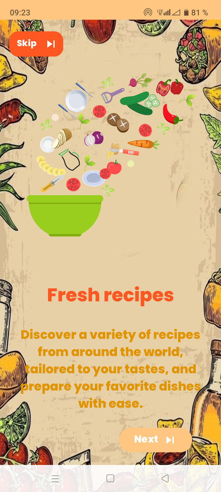 | 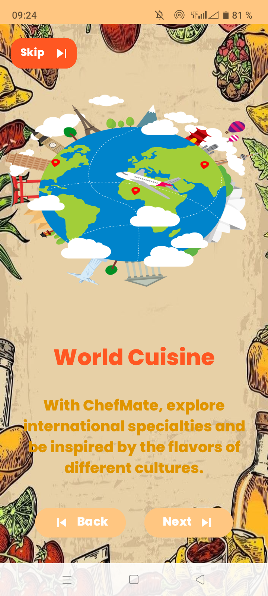 | 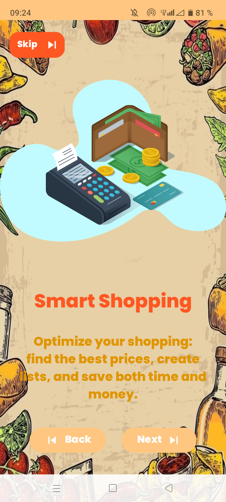 |

### 🔑 Connexion et Enregistrement
| In1 | In2 | In3 |
|-----|-----|-----|
| 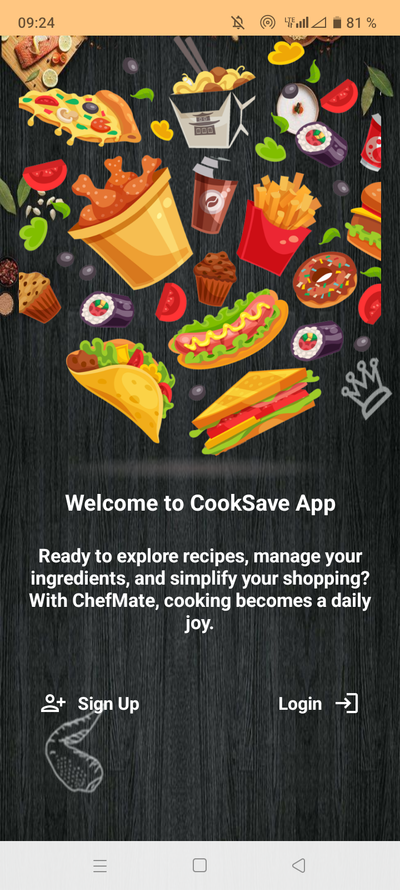 | 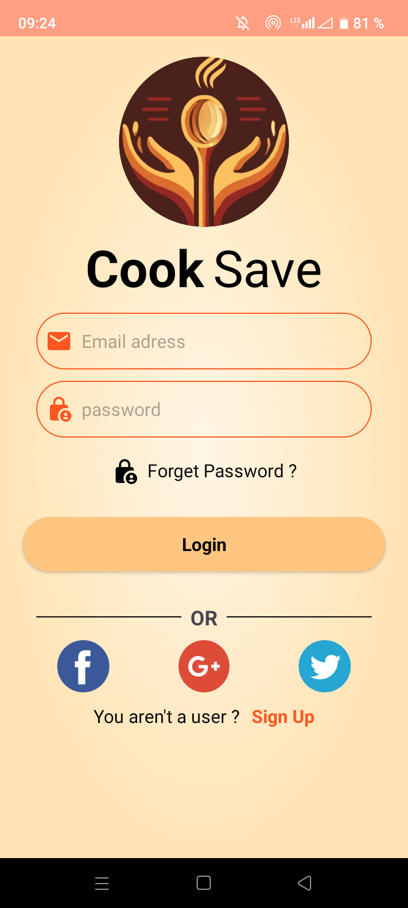 |  |

### 🍽️ Accueil - Page des Recettes Aléatoires
| In1 |In2 |
|-----|-----|
| 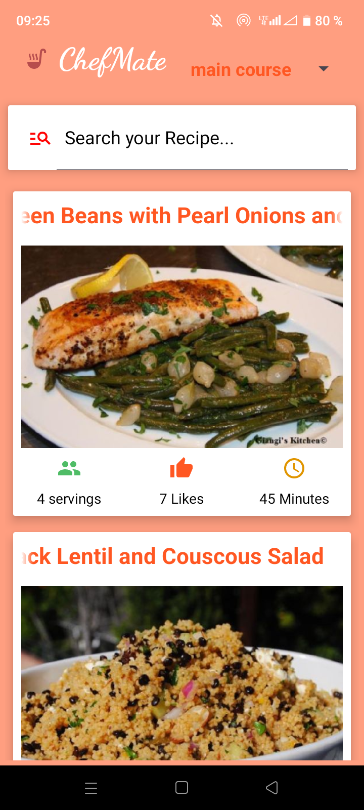 |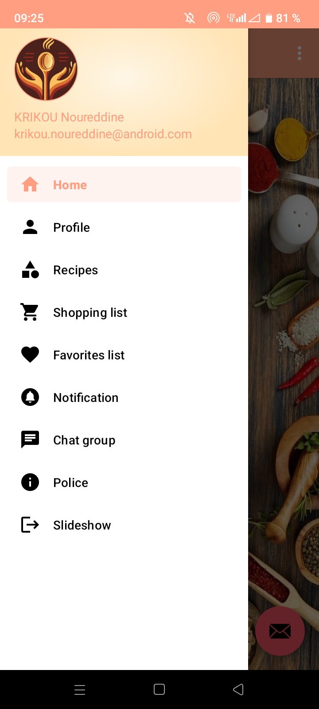 |

### 📂 Recettes par Catégories
| In1 |
|-----|
| 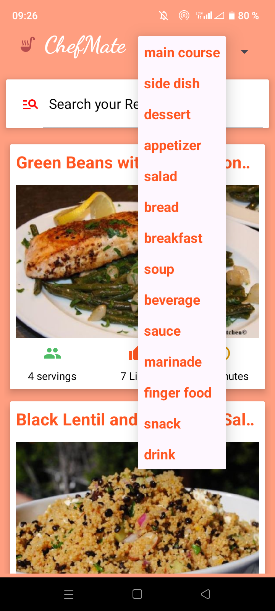 |

### 🔍 Recherche de Recettes
| In1 |
|-----|
| 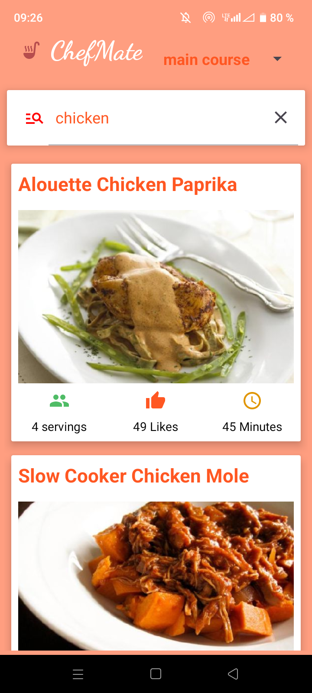 |

### 📖 Détails d’une Recette
| In1 | In2 | In3 |
|-----|-----|-----|
| 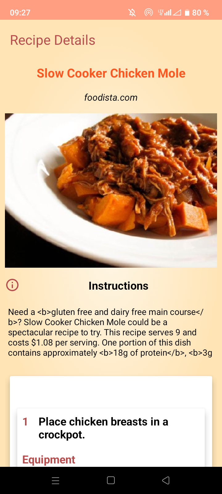 | 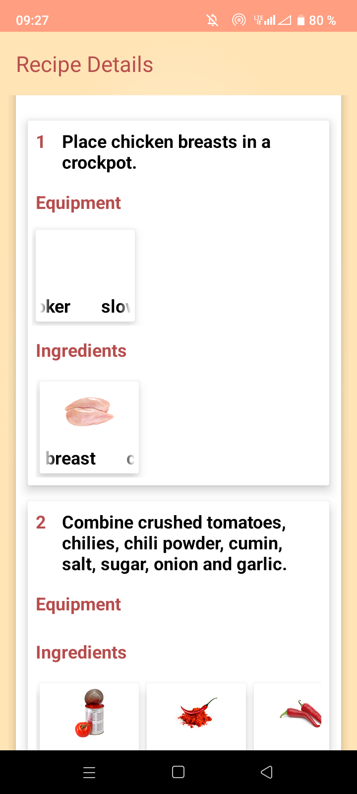 | 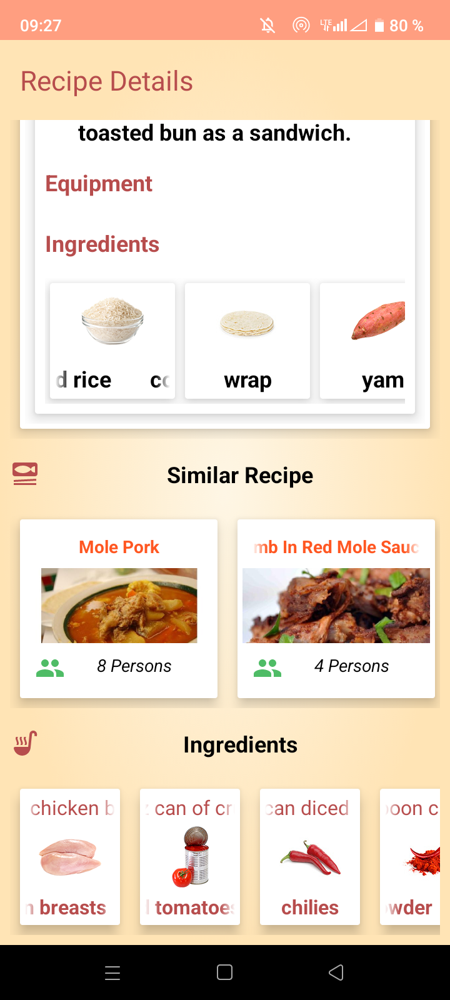 |

---

## 🎥 Vidéo de Présentation
🎥 [Voir la vidéo de présentation - Cliquez ici -]
(https://drive.google.com/file/d/1GldkgduyCsms0uyCwzus27wffzp5_uOQ/view?usp=sharing)

---

✅ **Profitez d’une expérience culinaire unique avec Cook&Save !**
